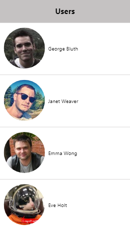

#  Ombori Project (React Code Test)

Ombori Project is a web application based on the React JS framework. It's purpose is to show list of people from [reqres.in](https://reqres.in/).

## Motivation

This app has been made to demonstrate programming skills, especially with the use of the React JS.

## Installation and starting app

The application installs with command `npm install`. After that it can be started with command `npm start`.

## Presentation

At the application startup the loading screen is shown: pulsing animation that lasts 3 seconds. Then main screen of application loads.

Main screen contains the list of peolpe, fetched from [reqres.in](https://reqres.in/). 
While loading, the main screen sends requests to the URL and forms the list of people
Every item in the list contains person's avatar, first name and last name. 
When list reaches the end of the screen, the loading stops 

If the app has loaded all of the data, at the end of the page relevant notice shows.

## Technology

The application's written in React JS framework. It consists of next modules.
1. index.tsx - React JS component, where application connect with Redux store.
1. App.tsx - React JS component, the main module, which imports all others and provides the logic of the application.
1. `components` - folder with working components:
    1. UserList.tsx - React JS component for rendering the list of people. It consists of the title and the scrollable list view.
    1. AnimationPulse.tsx - React JS component for rendering the loading screen. It contains animated sequence that uses CSS animation.
    1. Api.ts - JavaScript module with API to connect to the destination server. This module provides lower level of abstraction in application's model.
    1. store.ts - file for configuring Redux store.
1. `actions` folder - contains redux action modules:
    1. api.ts - action module for init API and keep to global store.
    1. user.ts - action module for requesting data and loading to global store.
1. `reducers` folder - contains redux reducers:
    1. apiReducer.ts - reducer for sending api data to global store.
    1. userReducer.ts - reducer for sending user data to global store.
1. *.css -  Files with CSS styles for components.

Every module is wrapped as Typescript module for type safety.

## Linter

Before submitting this code, all of linter's notices was checked and fixed.

## Author

The Ombori Project is made by [tuor4eg](https://github.com/tuor4eg). Thanks for your attention!